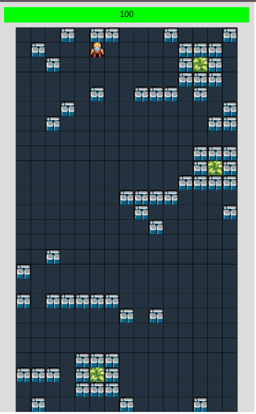
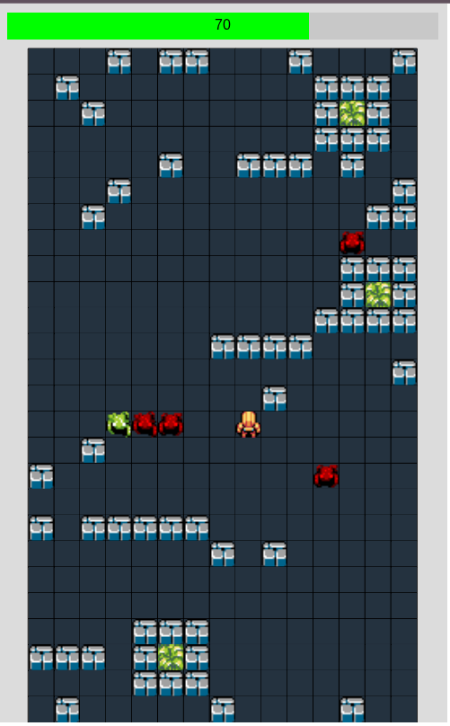
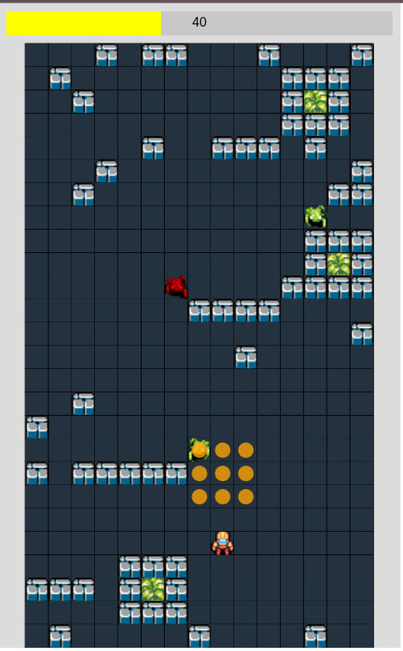
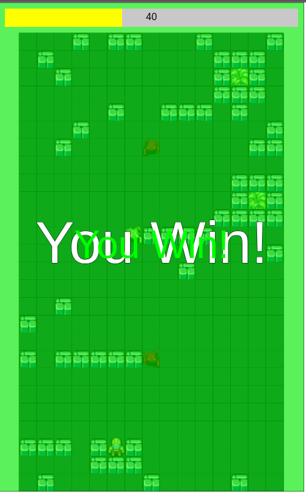

# Grid Survival Game (p5.js Experiment)

This project is a grid-based survival game developed as an experiment during *a 3-hour vibe coding session*. It incorporates a selection of resources, along with various improvements and bug fixes implemented during the session.

## How to Play

The objective of the game is to navigate the grid and reach one of the exit points while avoiding or eliminating opponents.

**Controls:**

*   **Arrow Keys:** Move the player up, down, left, or right.
*   **Spacebar:** Place a bomb at the player's current location.

## Game Elements

*   **Player:** Control the player character. The player has health and can be damaged by opponents and bombs. Reach an exit to win.
*   **Grid:** The game takes place on a grid with different cell types:
    *   **Empty:** Navigable cells.
    *   **Obstacle:** Impassable cells that can be destroyed by bombs.
    *   **Exit:** The goal of the game. Reach any exit to win.
*   **Opponents:** Enemies that move around the grid.
    *   **Basic Opponent:** Moves towards the player.
    *   **Shooter Opponent:** Moves towards the player or shoots projectiles if aligned horizontally or vertically.
*   **Projectiles:** Fired by shooter opponents. They travel in a straight line and damage the player on collision.
*   **Bombs:** Can be placed by the player. After a short timer, they explode, damaging opponents and destroying obstacles within a radius.
*   **Explosions and Particles:** Visual effects for bomb detonations and player damage.

## Winning and Losing

*   **Win:** Reach any of the exit points on the grid.
*   **Lose:** The player's health drops to zero.

## Technical Details

The game is built using the [p5.js](https://p5js.org/) JavaScript library for creative coding. The code is organized into multiple files, with each major game element represented by a class:

*   `sketch.js`: The main p5.js sketch file, handling game setup, drawing, updates, and interactions.
*   `player.js`: Defines the `Player` class, managing player movement, health, and animation.
*   `opponent.js`: Defines the `Opponent` class, handling opponent movement (including BFS pathfinding for basic opponents) and shooting behavior for shooter opponents.
*   `projectile.js`: Defines the `Projectile` class, managing projectile movement and collision detection.
*   `bomb.js`: Defines the `Bomb` class, handling bomb placement, timing, and explosion logic.
*   `explosion.js`: Defines the `Explosion` class for animating bomb explosions.
*   `particle.js`: Defines the `Particle` class for creating visual particle effects.

## How to Run

To run this game locally, you will need a simple web server to handle the loading of JavaScript modules.

1.  **Clone the repository:**
    ```bash
    git clone <repository_url>
    ```
2.  **Navigate to the project directory:**
    ```bash
    cd prototype_test_p5
    ```
3.  **Serve the files:**
    *   **Using VS Code Live Server Extension:** If you use VS Code, install the "Live Server" extension. Open the `index.html` file (you might need to create one if it doesn't exist, linking to `sketch.js`) and click "Go Live" in the bottom right corner of the VS Code window.
    *   **Using Python's Simple HTTP Server:** If you have Python installed, you can run a simple HTTP server from the project directory:
        ```bash
        python -m http.server
        ```
        Then, open your web browser and go to `http://localhost:8000`.
    *   **Other Local Server Options:** Any other method for serving static files locally will also work.

## Screenshots

Here are some screenshots from the game:

*   
*   
*   
*   

## Demo and Play

*   **Demo Reel Video:** [Video Demo](screenshots/Screencast from 20.05.2025 22:30:03.webm)
*   **Play on GitHub Pages:** https://raslab.github.io/p5js-survival-prototype/

## Future Improvements

*   Add more diverse enemy types with different behaviors.
*   Implement power-ups for the player (e.g., health packs, temporary invincibility, stronger bombs).
*   Design multiple levels with increasing difficulty and different grid layouts.
*   Add scoring and a high score system.
*   Improve sprite animations and add more visual polish.
*   Implement sound effects and background music.
